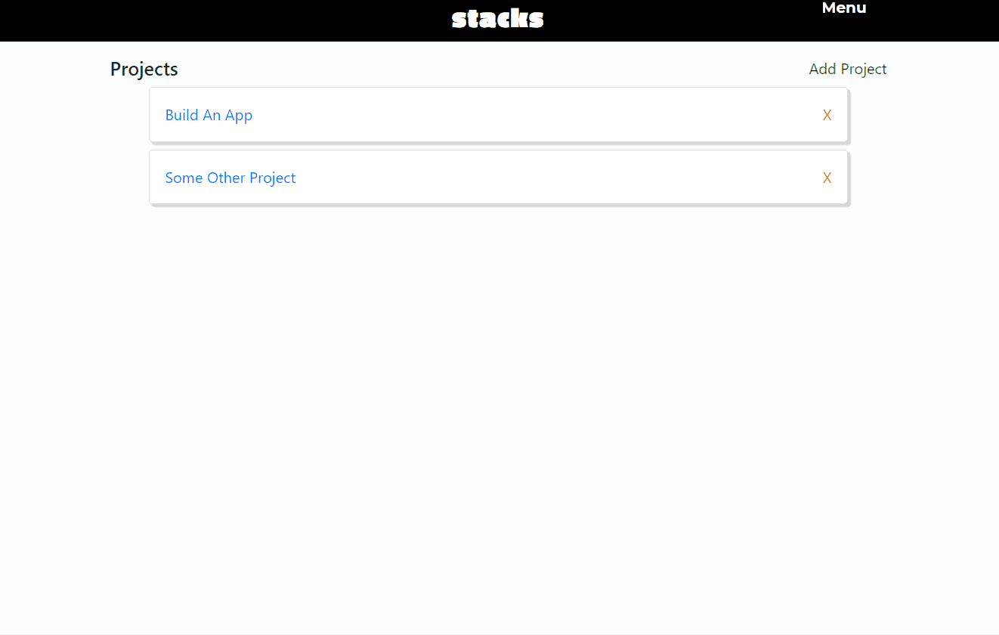

# Stacks

A web app for project management built with React/Redux, Node/Express, and PostgreSQL

Try it out at https://stacks-app.herokuapp.com


## Examples
* The top level contains your project.
* Each project has its own set of stacks
* Each stack has its own set of cards
* In each card you can make checklists, leave comments, and see past activity for the current card




## Tech Stack

* [react (v15)](https://facebook.github.io/react/) - View layer
* [react-router (v4)](https://reacttraining.com/react-router/web/guides/quick-start) - Router
* [redux](https://github.com/reactjs/redux) - State management
* [redux-thunk](https://github.com/gaearon/redux-thunk) - Async actions
* [sass](http://sass-lang.com/) - CSS preprocessor
* [babel](https://babeljs.io/) - ES6/JSX compiler
* [webpack (v2)](https://webpack.github.io/) - Module bundler
* [jest](https://facebook.github.io/jest/) - Test suite

## Development

Grab a copy of the .env from another developer

Clone the repo:

```sh
$ git clone https://github.com/andrewangelle/stacks.git
```

Install server dependencies:

```sh
$ npm install
```

Install client dependencies:

```sh
$ cd client && npm install
```

From the root, boot up the api server:

```sh
$ npm run dev
```

Open up another command line window and boot up client dev server:

```sh
$ cd client && npm run dev
```

Open up the app at http://localhost:3000
